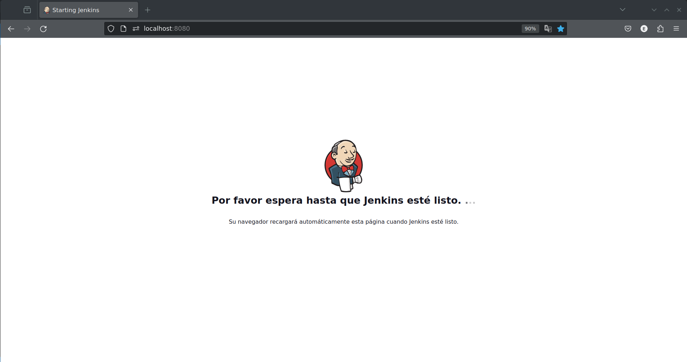
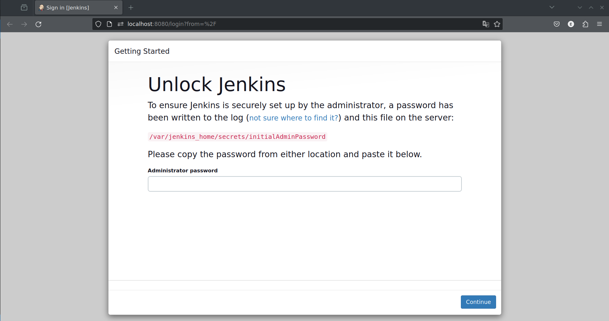
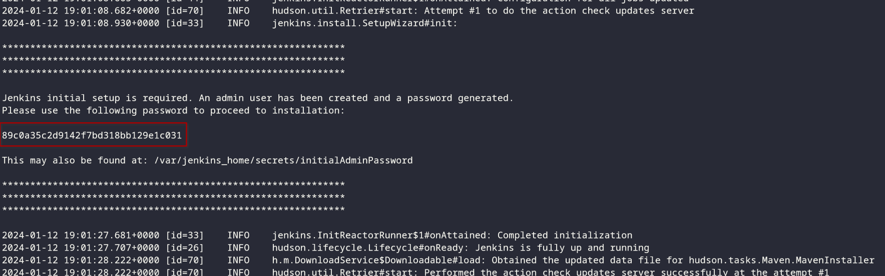
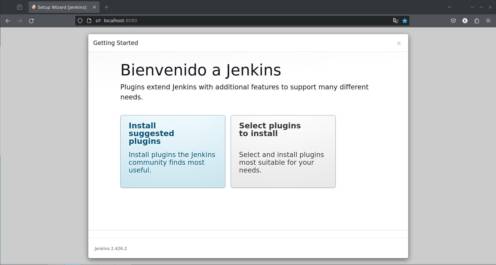
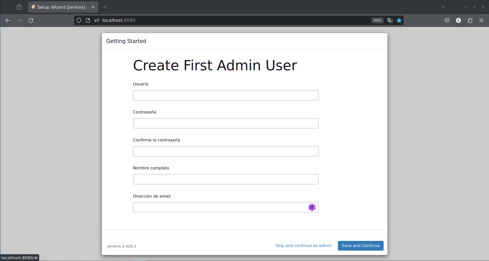
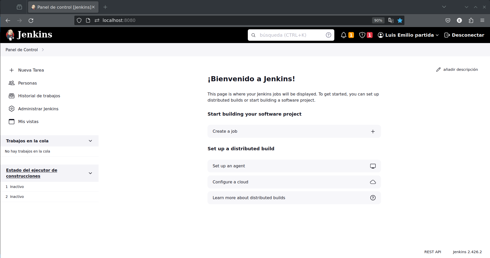

# Jenkins en Docker Compose


Este repositorio proporciona un entorno de Jenkins configurado para ejecutarse con Docker. Puedes utilizar este entorno para ejecutar un servicio de Jenkins de manera rápida y sencilla en tu máquina local.


- [Jenkins en Docker Compose](#jenkins-en-docker-compose)
  - [Requisitos previos](#requisitos-previos)
  - [Instrucciones de Uso](#instrucciones-de-uso)
  - [Detener y Eliminar Recursos de Jenkins](#detener-y-eliminar-recursos-de-jenkins)
  - [Configuración Inicial de Jenkins](#configuración-inicial-de-jenkins)


## Requisitos previos

Asegúrate de tener instalado Docker y Docker Compose en tu máquina antes de comenzar.

- [Docker](https://www.docker.com/get-started)
<!-- - [Docker Compose](https://docs.docker.com/compose/install/) -->

## Instrucciones de Uso

1. Clona este repositorio en tu máquina local:

    ```bash
    git clone https://github.com/LuisDeLaValie/Jenkins.git
    ```

2. Navega al directorio del repositorio clonado:

    ```bash
    cd Jenkins
    ```

3. Ejecuta el comando Docker Compose para iniciar Jenkins:

    ```bash
    docker-compose up -d
    ```

   Esto creará y levantará los contenedores definidos en el archivo `docker-compose.yml`.

4. Accede a Jenkins desde tu navegador web:

   [http://localhost:8080](http://localhost:8080)

   Al inicar jeckins nos pedira una contraseña que jecnkins ya genero, para poder ver la contraseña usaremos `docker logs`

5. Sigue el proceso de [configuración inicial de Jenkins](#configuración-inicial-de-jenkins).

6. ¡Listo! Jenkins está ahora en funcionamiento en tu máquina local.


## Detener y Eliminar Recursos de Jenkins

Para detener Jenkins y limpiar los recursos, ejecuta el siguiente comando:

```bash
docker-compose down
```

Esto detendrá y eliminará los contenedores de Jenkins y los recursos asociados.

## Configuración Inicial de Jenkins

Configurar Jenkins por primera vez es un paso esencial para aprovechar al máximo esta herramienta. Aquí tienes una guía detallada:

1. **Accede a Jenkins:**
   - Ingresa a Jenkins abriendo tu navegador y navegando a [http://localhost:8080](http://localhost:8080).

      

2. **Obtén la Contraseña de Inicialización:**
   - Jenkins generará una contraseña de inicialización única para garantizar la seguridad. Puedes encontrar esta contraseña en la pantalla de inicio de sesión.

    

3. **Recupera la Contraseña con Docker Logs:**
   - Utiliza el siguiente comando en tu terminal para obtener la contraseña desde los logs de Docker:

      ```sh
      docker logs jenkins-blueocean
      ```

      > Al ejecutar este comando, se mostrará la contraseña generada por Jenkins en la terminal.

      

4. **Selecciona los Plugins Iniciales:**
   - Después de ingresar la contraseña, Jenkins te guiará a través de la instalación de plugins. Puedes seleccionar los plugins recomendados o personalizar la instalación según tus necesidades.

      

5. **Crea un Usuario Administrador:**
   - Configura un usuario administrador proporcionando la información requerida, como nombre de usuario, contraseña y dirección de correo electrónico.

      

6. **Finaliza la Configuración:**
   - Después de instalar los plugins y crear el usuario administrador, Jenkins mostrará una pantalla de resumen. Haz clic en "Start using Jenkins" para finalizar la configuración inicial.

      <!--  -->

7. **¡Comienza a Utilizar Jenkins!**
   - ¡Felicidades! Ahora Jenkins está listo para su uso. Puedes empezar a crear y gestionar proyectos, configurar trabajos y explorar las potentes características que Jenkins ofrece.

      

Recuerda mantener la contraseña del administrador de Jenkins segura y actualizada para garantizar la seguridad de tu entorno de Jenkins.
